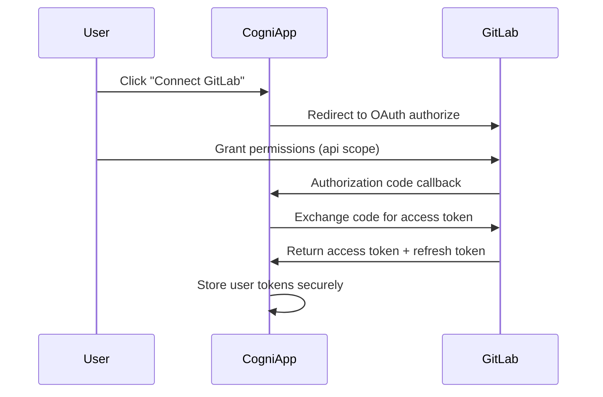

# GitLab Authentication Architecture

This document outlines the authentication model for GitLab integration, contrasting it with GitHub's App-based approach and detailing the OAuth + webhook pattern.

## Authentication Model Comparison

### GitHub App vs GitLab OAuth

| Aspect | GitHub App | GitLab OAuth |
|--------|------------|--------------|
| **Auth Entity** | App + Installation<br/>JWT → Installation Access Token | OAuth App<br/>Access Token for User/Bot |
| **Identity** | App Installation Identity | OAuth User (or dedicated bot user) |
| **Webhook Install** | Auto-wired on app installation | Manual API provisioning post-OAuth |
| **Secrets** | `PRIVATE_KEY` + webhook secret | `client_id/secret` + webhook secret |
| **Token Flow** | JWT → Installation Token → API | OAuth Token → API |

### Key Differences

**GitHub**: Uses App identity with scoped installation permissions. The app acts on behalf of itself with repository-specific access.

**GitLab**: Uses user identity with OAuth delegation. The user (or bot) acts on repositories they have access to.

## GitLab OAuth Architecture

### 1. Authentication Flow



### 2. OAuth Application Setup

**Application Type**: Confidential OAuth Application
- Server-side application with secure client secret storage
- Authorization Code flow with PKCE for security
- Confidential apps can refresh tokens server-side

**Required Scopes**:
- `api` - Full API access (MRs, webhooks, commit statuses, comments)
- `read_user` - User profile information via REST API
- `openid` - OpenID Connect authentication and ID token

**Conditional Scopes** (add only if used):
- `profile` - Profile data in ID token claims (add only if reading ID token claims)
- `email` - Email data in ID token claims (add only if reading ID token claims)  
- `offline_access` - Refresh token support (required on some GitLab setups)

**OAuth 2.0 + OpenID Connect Security Rules**:
- **ID Token Usage**: Login identity only. Verify `iss`, `aud`, `exp`, `iat`, `nonce` with `openid-client`/`jose`
- **API Authorization**: Use `access_token` for all REST calls. Never authorize API from ID token
- **Identity Binding**: Persist `sub` claim as stable `provider_user_id`. Do not trust email for identity
- **Profile Data**: Prefer UserInfo endpoint when claims missing from ID token
- **Token Refresh**: Refresh access tokens on expiry. Add `offline_access` scope if needed
- **PKCE + State**: Use PKCE with short state TTL. Strict `redirect_uri` validation
- **Self-hosted Support**: Feature-detect via OIDC discovery. Handle missing claims gracefully

**Security Model**:
```javascript
// OAuth + OIDC credentials (server-side only)
const OAUTH_CONFIG = {
  client_id: process.env.GITLAB_CLIENT_ID,
  client_secret: process.env.GITLAB_CLIENT_SECRET, // Never exposed to client
  redirect_uri: process.env.GITLAB_REDIRECT_URI,
  scope: 'api read_user openid' // + profile email if reading claims
};
```

### 3. Token Management

**Access Token Characteristics**:
- Expires after 2 hours by default
- Must be refreshed using refresh token
- Provides access as the authorizing user
- No JWT signing required (unlike GitHub Apps)

**Token Storage Schema**:
```sql
-- OAuth connections with encrypted tokens
CREATE TABLE oauth_connections (
  id UUID PRIMARY KEY DEFAULT gen_random_uuid(),
  user_id TEXT, -- nullable for MVP
  provider TEXT NOT NULL DEFAULT 'gitlab',
  provider_user_id TEXT NOT NULL, -- GitLab sub claim
  access_token_enc JSONB NOT NULL, -- {ciphertext, iv, tag} via AES-256-GCM
  refresh_token_enc JSONB NOT NULL, -- {ciphertext, iv, tag} via AES-256-GCM
  expires_at TIMESTAMPTZ NOT NULL,
  scopes TEXT DEFAULT 'api read_user openid',
  instance_url TEXT DEFAULT 'https://gitlab.com',
  created_at TIMESTAMPTZ DEFAULT NOW(),
  updated_at TIMESTAMPTZ DEFAULT NOW(),
  UNIQUE(provider, provider_user_id)
);
```

## Webhook Architecture

### 1. Manual Webhook Provisioning

Unlike GitHub Apps that auto-wire webhooks, GitLab requires explicit API calls:

```javascript
// Create webhook after OAuth authorization
const webhook = await gitlab.ProjectHooks.add(projectId, {
  url: `${WEBHOOK_BASE_URL}/gitlab`,
  merge_requests_events: true,
  note_events: true,
  push_events: true,
  token: generateWebhookSecret(),
  enable_ssl_verification: true
});

// Store webhook mapping
await db.projectWebhooks.create({
  project_id: projectId,
  webhook_id: webhook.id,
  webhook_secret: webhook.token,
  connection_id: connectionId
});
```

### 2. Webhook Security

**GitLab Webhook Headers**:
- `X-Gitlab-Token` - Webhook secret validation
- `X-Gitlab-Event` - Event type identification
- `X-Gitlab-Event-UUID` - Unique event identifier

**Request Validation**:
```javascript
function validateGitLabWebhook(req) {
  const providedToken = req.headers['x-gitlab-token'];
  const eventType = req.headers['x-gitlab-event'];
  const eventId = req.headers['x-gitlab-event-uuid'];
  
  // Verify webhook secret
  const expectedToken = await getWebhookSecret(req.body.project.id);
  if (!crypto.timingSafeEqual(
    Buffer.from(providedToken), 
    Buffer.from(expectedToken)
  )) {
    throw new Error('Invalid webhook signature');
  }
  
  return { eventType, eventId, payload: req.body };
}
```

### 3. Event Handling

**Core Events**:
- `Merge Request Hook` - MR opened/updated/merged/closed
- `Note Hook` - Comments on MRs and commits
- `Push Hook` - New commits for status updates

**Event Processing**:
```javascript
// GitLab webhook event router
async function handleGitLabWebhook(eventType, payload) {
  const connection = await getConnectionByProjectId(payload.project.id);
  
  switch (eventType) {
    case 'Merge Request Hook':
      return processMergeRequestEvent(payload, connection);
    case 'Note Hook':
      return processNoteEvent(payload, connection);
    case 'Push Hook':
      return processPushEvent(payload, connection);
    default:
      console.log(`Unhandled event type: ${eventType}`);
  }
}
```

## API Operations

### 1. Acting as OAuth User

All GitLab API operations use the user's OAuth token:

```javascript
const gitlab = new Gitlab({
  token: connection.access_token,
  host: 'https://gitlab.com'
});

// Comment on merge request (as OAuth user)
await gitlab.MergeRequestNotes.create(
  projectId,
  mergeRequestIid,
  { body: "## Cogni Review\n\n✅ All gates passed!" }
);

// Update commit status (as OAuth user)
await gitlab.Commits.editStatus(projectId, commitSha, {
  state: 'success',
  name: 'cogni/review',
  description: 'Quality gates completed'
});
```

### 2. Bot User Pattern (Optional)

For consistent identity, create a dedicated bot user:

**Bot Setup Process**:
1. Create `cogni-bot` GitLab user account
2. Invite bot as Developer to target projects
3. Run OAuth flow once for bot user
4. Store bot tokens for automated operations

**Bot Token Usage**:
```javascript
// Use bot token instead of user token for consistent identity
const botConnection = await getBotConnection();
const gitlab = new Gitlab({
  token: botConnection.access_token,
  host: 'https://gitlab.com'
});

// Comments now appear from @cogni-bot instead of random users
await gitlab.MergeRequestNotes.create(projectId, iid, {
  body: "🤖 Cogni automated review completed"
});
```

## Data Storage Requirements

### 1. Multi-Tenant Configuration

```javascript
// Per-tenant OAuth app configuration
const TENANT_CONFIG = {
  tenant_id: 'acme-corp',
  gitlab_instance_url: 'https://gitlab.com', // or self-hosted
  client_id: process.env.ACME_GITLAB_CLIENT_ID,
  client_secret: process.env.ACME_GITLAB_CLIENT_SECRET
};
```

### 2. Connection Storage

```javascript
// Per-connection data model
const CONNECTION_SCHEMA = {
  // OAuth identity
  user_id: 12345,
  gitlab_user_id: 67890,
  access_token: 'encrypted_token_string',
  refresh_token: 'encrypted_refresh_string',
  expires_at: '2024-01-01T12:00:00Z',
  
  // Selected projects
  project_ids: [100, 200, 300],
  
  // Webhook mappings
  webhooks: [
    { project_id: 100, webhook_id: 'hook_1', secret: 'secret_1' },
    { project_id: 200, webhook_id: 'hook_2', secret: 'secret_2' }
  ]
};
```

## Security Considerations

### 1. Token Security

**AES-256-GCM Encryption**:
```javascript
// Encrypt tokens with crypto.createCipheriv (32B key, 12B IV)
const crypto = require('crypto');

function encryptToken(token, key) {
  const iv = crypto.randomBytes(12); // 12-byte IV for GCM
  const cipher = crypto.createCipheriv('aes-256-gcm', Buffer.from(key, 'base64'), iv);
  const ciphertext = Buffer.concat([cipher.update(token, 'utf8'), cipher.final()]);
  const tag = cipher.getAuthTag();
  
  return {
    ciphertext: ciphertext.toString('base64'),
    iv: iv.toString('base64'),
    tag: tag.toString('base64')
  };
}

// Store {ciphertext, iv, tag} in JSONB column
await db.connections.update(connectionId, {
  access_token_enc: encryptToken(accessToken, ENCRYPTION_KEY)
});
```

**Token Refresh Logic**:
```javascript
async function ensureValidToken(connection) {
  if (Date.now() > connection.expires_at) {
    const refreshed = await refreshGitLabToken(connection.refresh_token);
    await updateConnectionTokens(connection.id, refreshed);
    return refreshed.access_token;
  }
  return connection.access_token;
}
```

### 2. Webhook Security

**Webhook Secret Security**:
- Never persist webhook secrets in plaintext
- Store HMAC-SHA256 hashed secrets only
- Compare using `tsscmp` for timing-safe validation
- Generate cryptographically secure secrets per webhook

**Request Integrity**:
- Validate `X-Gitlab-Event-UUID` for replay protection
- Log webhook events for audit trails
- Implement rate limiting per project

## Migration from GitHub App Model

### 1. Architecture Changes

**Remove GitHub App Concepts**:
- No `PRIVATE_KEY` environment variable
- No JWT token generation
- No installation access token flow

**Add OAuth Components**:
- OAuth authorization flow endpoints
- Token refresh middleware
- User consent and project selection UI

### 2. API Client Adaptation

**Before (GitHub App)**:
```javascript
// GitHub App JWT → Installation Token
const jwt = generateJWT(privateKey, appId);
const installationToken = await getInstallationToken(jwt, installationId);
const octokit = new Octokit({ auth: installationToken });
```

**After (GitLab OAuth)**:
```javascript
// OAuth Token → Direct API Access
const validToken = await ensureValidToken(connection);
const gitlab = new Gitlab({ token: validToken });
```

### 3. Identity Management

**GitHub**: App acts with `app[bot]` identity
**GitLab**: User/bot acts with their own identity

This requires updating UI expectations - comments will show the OAuth user's name rather than a consistent app identity (unless using bot pattern).

## MVP: GitLab OAuth Implementation

### MVP Scope: Single-User OAuth2 + OIDC

**Characteristics**:
- One deployment per GitLab instance/tenant
- OAuth credentials in environment variables
- Per-deployment connection storage
- Manual scaling for multi-tenant scenarios

**Environment Configuration**:
```bash
# V1 Environment Variables
GITLAB_OAUTH_APPLICATION_ID=your_gitlab_oauth_client_id
GITLAB_OAUTH_APPLICATION_SECRET=your_gitlab_oauth_client_secret
WEBHOOK_SECRET_GITLAB=shared_webhook_secret
```

**MVP Implementation Specification**:

**Routes**: 
- `GET /oauth/gitlab/start` - Initiate OAuth flow
- `GET /oauth/gitlab/callback` - Handle OAuth callback

**Libraries**: `openid-client`, `zod`, `jose`
**API Client**: Prefer `fetch()` for MVP. GitBeaker optional for later enhancement.

**Environment Variables**:
```bash
BASE_URL=https://cogni.app
GITLAB_BASE_URL=https://gitlab.com
GITLAB_OAUTH_CLIENT_ID=your_oauth_app_id  
GITLAB_OAUTH_CLIENT_SECRET=your_oauth_app_secret
ENCRYPTION_KEY=base64_encoded_32_byte_key
```

**Storage**: SQLite file `data/cogni.db`

**OAuth Flow**:
1. **Start**: Generate state+nonce+PKCE → redirect to GitLab authorize
2. **Callback**: Verify state → exchange code → store encrypted tokens → link provider_user_id → redirect `/connected`
3. **Usage**: Attach Bearer token; if expiring (<60s), refresh once then retry

**Security Features**:
- Cookies: `Secure+HttpOnly+SameSite=Lax`
- Tokens at rest: AES-256-GCM with `ENCRYPTION_KEY`
- Webhook tokens: Store HMAC digest only
- Logging: Mask secrets, include request correlation ID

**Acceptance Criteria**:
- ✅ OAuth flow completes and persists tokens
- ✅ Token refresh works and recovers from single 401
- ✅ One MR API call succeeds using stored OAuth token

**MVP Deferrals**:
- Project selector UI (use all accessible projects)
- Webhook auto-provisioning (manual setup)
- Multi-provider support (GitLab only)
- Admin UI and key rotation workflows

## V2: Production Multi-Provider System

**Core Design Principles**:
- **Single Deployment**: One server handles all tenants
- **Zero Per-Tenant Env Vars**: All configuration in database
- **Provider Abstraction**: Unified interface for GitHub/GitLab
- **Self-Hosted Support**: BYO OAuth for enterprise GitLab

**Architecture Changes**:

#### 1. Database-Driven Configuration

Replace environment variables with encrypted database storage:

```typescript
// V2 Install Model
interface Install {
  id: string
  provider: 'github' | 'gitlab'
  instanceUrl: string        // gitlab.com or self-hosted
  projectId: string
  ownerSlug: string
  auth: {
    type: 'app' | 'oauth'
    clientId?: string        // Encrypted at rest
    clientSecret?: string    // Encrypted at rest
    accessToken?: string     // Encrypted at rest
    refreshToken?: string    // Encrypted at rest
  }
  webhookId: string
  createdByUser: string
}
```

#### 2. Provider Abstraction Layer

**OAuth Provider Interface**:
```typescript
interface OAuthProvider {
  authorizeUrl(ctx: OAuthContext): string
  exchangeCode(ctx: OAuthContext): Promise<TokenSet>  
  refresh(tokenSet: TokenSet): Promise<TokenSet>
  userinfo(tokenSet: TokenSet): Promise<UserInfo>
}
```

**VCS Provider Interface**:
```typescript  
interface VCSProvider {
  getRepo(connection: Connection, id: string): Promise<Repository>
  getMR(connection: Connection, id: string): Promise<MergeRequest>
  listFiles(connection: Connection, mrId: string): Promise<FileChange[]>
  getFile(connection: Connection, path: string, ref?: string): Promise<FileContent>
  setStatus(connection: Connection, sha: string, status: CommitStatus): Promise<void>
  comment(connection: Connection, mrId: string, body: string): Promise<void>
}
```

**Universal Routes**:
- `GET /oauth/:provider/start` → `provider-registry.get(provider).authorizeUrl()`
- `GET /oauth/:provider/callback` → `provider-registry.get(provider).exchangeCode()`

#### 3. Multi-Instance Support

**GitLab.com**: Central OAuth app managed by Cogni
```typescript
// Predefined gitlab.com client
const GITLAB_COM_CLIENT = {
  instanceUrl: 'https://gitlab.com',
  clientId: process.env.GITLAB_COM_CLIENT_ID,
  clientSecret: process.env.GITLAB_COM_CLIENT_SECRET
}
```

**Self-Hosted GitLab**: BYO OAuth pattern
```typescript
// User provides their own OAuth app credentials
const installFlow = {
  step1: 'User enters self-hosted GitLab URL',
  step2: 'System detects no stored OAuth client',
  step3: 'UI prompts for admin-created client credentials',
  step4: 'Credentials encrypted and stored in Install.auth',
  step5: 'Standard OAuth flow proceeds'
}
```

#### 4. Unified Webhook Routing

Single endpoint handling all providers:

```typescript
// V2 Webhook Architecture  
app.post('/webhook/:provider', async (req, res) => {
  const { provider } = req.params
  
  // Route by provider and validate
  switch (provider) {
    case 'github':
      // Verify GitHub HMAC signature
      const install = await getInstallByRepoId(req.body.repository.id)
      break
    case 'gitlab':  
      // Verify GitLab X-Gitlab-Token
      const install = await getInstallByProjectId(req.body.project.id)
      break
  }
  
  // Process through unified interface
  const host = createHostProvider(install)
  await processWebhookEvent(host, req.body)
})
```

#### 5. OAuth Callback Routing

Provider-specific OAuth handling:

```typescript
// V2 OAuth Architecture
app.get('/oauth/callback/:provider', async (req, res) => {
  const { provider } = req.params
  
  switch (provider) {
    case 'github':
      // Not used - GitHub uses App installation
      break
    case 'gitlab':
      // Exchange code for tokens using Authorization Code + PKCE
      const tokens = await exchangeGitLabCode(req.query.code)
      await createInstall(provider, tokens)
      break
  }
})
```

### Migration Strategy

#### Phase 1: V1 Foundation
- [ ] Implement basic GitLab OAuth integration
- [ ] Single-deployment environment configuration  
- [ ] Standard webhook provisioning
- [ ] Connection storage in existing database

#### Phase 2: Provider Abstraction
- [ ] Create Host interface specification
- [ ] Implement GitHubProvider (wrap existing Probot logic)
- [ ] Implement GitLabProvider (OAuth + REST API)
- [ ] Unified webhook event processing

#### Phase 3: Database Migration
- [ ] Design Install model schema
- [ ] Migrate existing connections to Install format
- [ ] Implement credential encryption at rest
- [ ] Remove environment variable dependencies

#### Phase 4: Multi-Tenant Capabilities
- [ ] Self-hosted GitLab OAuth client management
- [ ] Per-tenant credential isolation
- [ ] Admin UI for OAuth client configuration
- [ ] Tenant-scoped webhook routing

### V2 Benefits

**Operational**:
- Single deployment scales to unlimited tenants
- No environment variable management per tenant  
- Centralized credential rotation and monitoring

**Security**:
- All secrets encrypted at rest in database
- Per-tenant credential isolation
- Audit trails for all OAuth operations

**Flexibility**:
- Support for self-hosted GitLab instances
- Mix GitHub and GitLab projects in single tenant
- Provider-agnostic gate execution

### Implementation Timeline

**V1 (MVP)**: 2-3 weeks
- Basic GitLab OAuth + webhook integration
- Single-deployment model
- Environment variable configuration

**V2 (Scale)**: 4-6 weeks after V1
- Provider abstraction layer
- Database-driven multi-tenancy  
- Self-hosted GitLab support

---

*V1 provides immediate GitLab integration capability, while V2 enables scalable multi-tenant architecture supporting both GitHub and GitLab with zero per-tenant configuration overhead.*